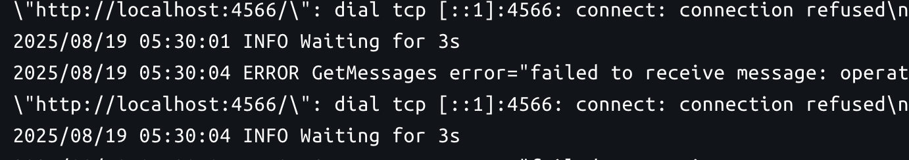

# Token Balance Indexer


## Flow-Diagram


#### 추가 설명 (특이 사항)
- DB 쪽에 Edge Cases 부분
    - 블록들을 Backfill 할 때, DB가 수정되어서 사이사이에 빈 블록이 생길 수 있는 경우를 고민했었는데, 애초에 DB가 수정된다면 token_balances 값들도 다 수정될 수도 있고 이를 고려하는 것은 너무 복잡하다고 판단하여서, 가장 마지막 블록부터 Backfill을 시작하도록 하였습니다.
- Indexer Client 부분
  - 제공해주신 두 가지 tx-indexer URL을 환경변수로 받아서, 순서대로 시도하도록 하였습니다.
- Balance API 부분
 - 요구된 Endpoint외에 `/health` 를 단순히 서버가 잘 동작하는지 확인하기 위한 용도로 추가하였습니다.


## Database Schema
- 개발 도중에는 goose를 사용하여, migration을 관리하였습니다. (`./sql/schema`)
- 각각 마이그레이션 별로 모아서, `./schema.sql` 파일에 작성하였습니다.


## 실행 방법
1. `.env.example` 파일을 이용하여 `.env` 파일을 생성합니다.
    > 각각 서비스에 따라서 필요한 환경변수들만 받도록 하는 방식이 권장될 같았지만, 현재는 편의상으로 모든 환경변수를 `.env` 파일에서 관리하도록 하였습니다.

2. SQS queue를 생성합니다. 이미 생성된 queue를 사용하려면 환경변수 `SQS_QUEUE_URL` 를 설정하여야 합니다.
    ```bash
    awslocal sqs create-queue --queue-name event-queue
    ```

3. Docker를 이용하여 서비스를 실행합니다.
    ```bash
    docker-compose up -d
    ```

  실행 후, 각각 서비스의 로그를 확인하면 정상적으로 동작하는지 확인할 수 있습니다.

#### Block Synchronizer


- Back Fill작업과 동시에 실시간으로 블록을 동기화합니다.

#### Event Processor


- sqs에서 이벤트를 3초마다 가져와서 처리하도록 구현했습니다. 에러로그는 sqs 에서 데이터가 없을 때마다 발생하는데, 우선 이를 그대로 출력하도록 하였습니다.

#### Balance API


## Test

- 각각 테스트에 필요한 종속성들을 Flag를 통해서 관리하였습니다. [`./internal/test/flag.go`](./internal/test/flag.go)
- 각각 사용가능한 Flag는 다음과 같습니다.
  - `-test.db` : database를 사용하는 테스트를 수행합니다. 
    - DB의 호스트를 변경하여서(localhost) DB연동 테스트를 하였습니다. 
    - [`./internal/database/test.go`](./internal/database/test.go)
  - `-test.sqs` : SQS를 사용하는 테스트를 수행합니다.
     - 테스트용 queue를 생성한 상태에서 테스트를 수행하도록 하였습니다. 
     - [`./internal/sqs/client_test.go`](./internal/sqs/client_test.go)
  - `-test.indexer` : Indexer를 사용하는 테스트를 수행합니다. (http 요청을 통해 실제 데이터를 가져옴)
     - 추가로 subscribe_block 테스트를 위해서는 `-min-blocks` flag을 추가하였습니다. 
     - [`./internal/indexer/subscribe_block_test.go`](./internal/indexer/subscribe_block_test.go)


- 따라서, 모든 테스트를 수행하면 다음과 같이 실행할 수 있습니다.
```bash
go test -v ./... -test.db -test.sqs -test.api -test.indexer
```
#### Test 결과


- 개발 동안에는 이런식으로 필요한 부분을 포함해서 테스트를 수행하도록 하였는데, 실제 배포 환경에서는 추가적인 환경 분리가 가능하도록 해야할 것 같습니다.

## 기타

### 눈여겨 볼 만한 부분
Block synchronizer 에서 블록 별 transaction의 batch 처리를 위해서, 각 블록의 순회하여 원하는 배치 만큼의 인덱스의 범위가 어디인지를 계산하는 로직이 필요했습니다. 복잡한 로직이라고 생각했지만, 테스트를 통한 검증으로 구현할 수 있었습니다.
- 구현: [`./internal/service/block-synchronizer/calculate_vars.go`](./internal/service/block-synchronizer/calculate_vars.go)
- 테스트: [`./internal/service/block-synchronizer/calculate_vars_test.go`](./internal/service/block-synchronizer/calculate_vars_test.go)


### 느낀 점
- Docker를 활용한 MSA를 처음으로 구현해보았는데, 환경 변수 관리나 서비스 간의 의존성 관리가 생각보다 복잡하다는 것을 느꼈습니다.
- 실제 서비스 단계에서 사용할 수 있게끔, 좀 더 conventional 한 구조를 알고, 좋은 환경 변수 관리 방식을 고려해야할 것 같습니다.
- 또한, SQS, graphql, gorm 등 자주 사용하지 않았던 기술을 익히는데 시간이 많이 소요되었습니다. 이 또한 앞으로 여러 프로젝트를 구현해보면서 익숙해져야 할 것 같습니다.
- 블록체인을 다루는 서비스는 처음이였는데, 블록과 트랙잭션의 관계를 배울 수 있었던 좋은 경험이였습니다.